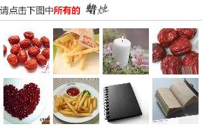
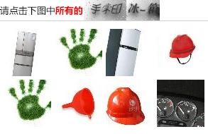
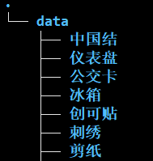
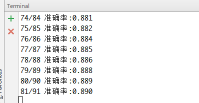

# 基于深度学习识别12306验证码

## 简介

使用深度学习的方法识别12306验证码，采用了当前效果最好的卷积网络模型之一：[DenseNet](https://github.com/liuzhuang13/DenseNet)

代码参考了一种DenseNet的Keras实现：[titu1994/DenseNet](https://github.com/titu1994/DenseNet)


12306验证码图片地址为：https://kyfw.12306.cn/passport/captcha/captcha-image

需要识别的有2部分：
- 上方的文字部分
- 下方的8张图片

文字部分有两种：




文字部分出现两个词时，需要对其进行切割。

## 运行环境
- Keras 2.1.3 (TensorFlow backend)
- TensorFlow 1.4

## 准备数据

把图片数据保存在以类别名称命名的文件夹下，如：



## 训练模型

修改`run.py`文件开头的训练参数

```python
batch_size = 64
n_gpus = 2                  # 训练时使用的GPU数
n_epochs = 40               # 训练轮数
image_shape = (64, 64, 3)   # 图片大小（其他尺寸的图片会被调整到此尺寸）
n_classes = 80              # 类别数（12306验证码图片为80类）
initial_learning_rate = 0.1 # 初始的学习率
reduce_lr_epoch_1 = 20
reduce_lr_epoch_2 = 30      # 指定每次学习率衰减的训练轮数
image_dir = "图片文件夹路径"
```

训练模型

```
# DenseNet模型
python run.py --train -m=DenseNet -k=12 -d=40

# DenseNet-BC模型
python run.py --train -m=DenseNet-BC

# 模型参数
python run.py --help
```

训练时每个epoch后，模型权重文件保存在`saves`文件夹下，文件名如：`DenseNet-BC_k=12_d=40.weight`。

再次开始运行相同模型的训练，会先读取已保存的权重。

## 评估/测试模型

在`run.py`中指定评估图片的文件夹`image_dir`，执行：

```
python run.py --test -m=DenseNet -k=12 -d=40
# 模型参数与训练参数一致
```


## 在12306上进行验证码识别/提交测试

模拟12306验证码验证流程：
1. 下载验证码图片到本地
2. 读取两个模型，分别识别文字部分、图像部分
3. 根据识别的结果，提交post请求验证
4. 12306返回验证结果

验证成功的文字部分和图像部分会分别按类别保存到指定文件夹中。若验证失败，保存原始图片。


修改`12306_test.py`：
```python
n_classes = 80
image_shape = (64, 64, 3)
text_model_weight = "saves/DenseNet-BC_k=12_d=40.weight"    # 文字部分模型保存路径
image_model_weight = "saves/DenseNet-BC_k=24_d=40.weight"   # 图片部分模型保存路径
save_path = "D:\IMAGE"      # 验证成功的图片保存路径
save_fail_path = "D:\IMAGE\FAIL"    # 验证失败的图片保存路径
```

运行`12306_test.py`
```
python 12306_test.py
```



